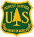

# LCMS Outreach — Workshop Notebooks

<p>
  
  &nbsp;&nbsp;
  
  &nbsp;&nbsp;
  
</p>

LCMS access and analysis content and examples, developed for the Ecological Society of America (ESA) Meeting, July 2026, Salt Lake City. 

This repo contains two workshop notebooks, standalone examples, and reporting scripts demonstrating how to access and analyze the USDA Forest Service Landscape Change Monitoring System (LCMS) in Google Earth Engine (GEE) using the geeViz Python library.

If you are new to LCMS, start with the `notebooks/lcms_introduction.ipynb` notebook. If you are interested in a deeper dive into forest management and recovery, try the `notebooks/macdunn_harvest_recovery.ipynb` notebook.

LCMS is also accessible via the [LCMS Viewer GUI](https://apps.fs.usda.gov/lcms-viewer/), the [GEE catalog](https://developers.google.com/earth-engine/datasets/catalog/USFS_GTAC_LCMS_v2025-11), and the [USFS Raster Data Gateway](https://data.fs.usda.gov/geodata/rastergateway/LCMS/index.phps).

---

## What is LCMS?


The [Landscape Change Monitoring System (LCMS)](https://www.fs.usda.gov/lcms) is an annual remote-sensing product produced by the USDA Forest Service Geospatial Technology and Applications Center (GTAC). It maps land cover, land use, and change processes across CONUS and SE Alaska at 30 m resolution from 1985 to present.

Three annual thematic products:

| Band | Description | Key Classes |
|------|-------------|-------------|
| `Change` | The dominant change process | Wildfire, Insect/Disease, Tree Removal, Vegetation Gain, Stable, … |
| `Land_Cover` | What is physically on the ground | Trees, Shrubs, Grass/Forb/Herb, Barren, Water, Snow/Ice |
| `Land_Use` | How the land is used or managed | Forest, Agriculture, Developed, Rangeland/Pasture, Other |

GEE catalog asset: **`USFS/GTAC/LCMS/v2025-11`** (latest release; covers 1985–2025)

---

## Repository Structure

```
lcms-outreach/
├── README.md                          ← you are here
├── requirements.txt                   ← Python dependencies
│
├── notebooks/                         ← Workshop notebooks (start here)
│   ├── lcms_introduction.ipynb        ← Intro: H.J. Andrews Experimental Forest
│   └── macdunn_harvest_recovery.ipynb ← Deep dive: McDonald-Dunn harvest/recovery
│
├── examples/                          ← Standalone scripts and supplemental notebooks
│   ├── LCMS_Levels_Viewer_Notebook.ipynb  ← Crosswalk LCMS to different thematic levels
│   └── time_lapse_example.py          ← Minimal time-lapse script
│
├── reporting/                         ← geeViz report generation examples
│   ├── report_gsl_landcover.py        ← Great Salt Lake land cover report
│   └── report_lolo_fire.py            ← Lolo National Forest fire report
│
├── data/
│   ├── aois/                          ← Study area GeoJSON boundaries
│   └── metadata/                      ← LCMS class lookup tables (JSON)
│
└── tutorials/
    └── LCMS_v2024-10_Data_Explorer_Overview.pdf  ← LCMS Explorer GUI walkthrough
```

---

## Notebooks

### `notebooks/lcms_introduction.ipynb`

**Study area:** [H.J. Andrews Experimental Forest](https://andrewsforest.oregonstate.edu/) — a 64 km² LTER site in the western Oregon Cascades with a well-documented history of experimental and commercial timber harvest (1950s–1990s) followed by natural recovery.

**Research question:** What can 40 years of LCMS data reveal about land cover and change at a long-term ecological research site?

| Section | Analysis |
|---------|----------|
| 1 · Setup | GEE authentication and library imports |
| 2 · Study Area | H.J. Andrews boundary from local GeoJSON |
| 3 · Load LCMS | Filter collection, inspect bands and class tables |
| 4 · Interactive Map | geeViz map with Land Cover, Land Use, and Change layers (2025) |
| 5 · Time Lapse | Animated slider through all three LCMS bands, 1985–2025 |
| 6 · Change Agents Over Time | Annual area chart of key disturbance classes |
| 7 · Land Cover Over Time | Stacked area chart of all Land Cover classes 1985–2025 |
| 8 · Tree Canopy Cover | USFS TCC product paired with LCMS Change record |
| 9 · Next Steps | Interpretation guide and ideas for further exploration |

---

### `notebooks/macdunn_harvest_recovery.ipynb`

**Study area:** [McDonald-Dunn Research Forest](https://cf.forestry.oregonstate.edu/our-forests/mcdonald-and-dunn-forests) — ~11,500 acres in the Oregon Coast Range foothills, actively managed by Oregon State University with well-documented harvest history.

**Research question:** How do actively managed compartments cycle through LCMS-detectable change and recovery stages across the 40-year record?

| Section | Analysis |
|---------|----------|
| 1 · Setup | GEE authentication and library imports |
| 2 · Study Area | McDonald-Dunn boundary and age-class polygons |
| 3 · Load LCMS | Filter collection, inspect Change classes relevant to active management |
| 4 · Interactive Map | Current land cover + harvest history layers |
| 5 · Age-Class Stands | Select representative stands per harvest age class (9–60 years) |
| 6 · Recovery Trajectories | Annual Land Cover % per stand from 1985–2025 |
| 7 · Change Agent Signatures | Tree Removal and Successional Growth timing per stand |
| 8 · Combined Comparison | Tree cover % across all age classes on one chart |
| 8b · TCC Trajectories | USFS Tree Canopy Cover % per stand |
| 8c · TCC + Change Agent | Side-by-side panels: canopy cover vs. change agents |
| 9 · Land Use Sankey | Land Use transition flow diagram across four decades |
| 10 · Time-Lapse Map | Animated Change and Land Cover, 1985–2025 |
| 11 · Bonus | Classify every pixel by years-as-trees (successional maturity proxy) |
| 12 · Takeaways | Key findings and next steps |

---

## Examples

### `examples/LCMS_Levels_Viewer_Notebook.ipynb`

Demonstrates how to **crosswalk LCMS products to different thematic levels** — remapping the full class set to coarser aggregations and updating symbology accordingly. Covers all three products (Change, Land Cover, Land Use) and shows how accuracy changes across levels.

### `examples/time_lapse_example.py`

Minimal standalone script showing how to build an LCMS time-lapse animation with geeViz.

---

## Reporting Scripts

Scripts in `reporting/` demonstrate using LCMS data with the geeViz `Report` API — generating multi-section HTML analysis reports for a given study area.

| Script | Study Area / Topic |
|--------|--------------------|
| `report_gsl_landcover.py` | Great Salt Lake — land cover change report |
| `report_lolo_fire.py` | Lolo National Forest — fire disturbance report |

---

## Setup

### Prerequisites

- A **Google Earth Engine account** — [sign up free](https://earthengine.google.com/signup/)
- A **GEE Cloud Project** — [create one](https://developers.google.com/earth-engine/guides/access/cloud_projects) (free for non-commercial use)
- Python ≥ 3.9

### Install dependencies

```bash
pip install -r requirements.txt
```

### Authenticate with GEE

Run this once per machine:

```bash
earthengine authenticate
```

Or call `ee.Authenticate()` inside the first notebook cell (already included, commented out).

### Open a notebook

```bash
jupyter lab
# or
jupyter notebook
```

Then open a notebook from the `notebooks/` folder and run cells top-to-bottom (`Kernel → Restart & Run All`). The recommendation is to start with the `lcms_introduction.ipynb` notebook, then move on to `macdunn_harvest_recovery.ipynb`.

> ⚠️ **Replace `'your-project-id'`** in the Setup cell with your actual GEE Cloud project ID before running.

---

## Key Libraries

| Library | Purpose |
|---------|---------|
| [`earthengine-api`](https://github.com/google/earthengine-api) | Python client for Google Earth Engine |
| [`geeViz`](https://github.com/redcastle-resources/geeViz) | USFS GTAC visualization and analysis toolkit built on EE |
| [`plotly`](https://plotly.com/python/) | Interactive charts (included via geeViz) |
| [`pandas`](https://pandas.pydata.org/) | DataFrame manipulation |

---

## LCMS Data Access

- [LCMS Viewer (GUI)](https://apps.fs.usda.gov/lcms-viewer/) — explore LCMS data without code
- [LCMS GEE catalog page](https://developers.google.com/earth-engine/datasets/catalog/USFS_GTAC_LCMS_v2025-11)
- [LCMS Raster Data Download](https://data.fs.usda.gov/geodata/rastergateway/LCMS/index.phps) — bulk download of LCMS GeoTIFFs. Downloads are also available via the LCMS Viewer GUI and the GEE catalog.

## Additional Resources
- [geeViz documentation](https://github.com/redcastle-resources/geeViz)
- [USFS GTAC website](https://www.fs.usda.gov/about-agency/gtac)
- [Training for Building LCMS](https://github.com/redcastleresources/lcms-training) — a separate repo with example notebooks for building LCMS products in GEE

---

## LCMS User Survey

Enjoying the LCMS data and tools? Please consider filling out the [LCMS User Survey](https://survey123.arcgis.com/share/5b82d464bf154f20931250754c24b4d2) to help us improve future releases.

## LCMS Explorer Instructions

See [tutorials/LCMS_v2024-10_Data_Explorer_Overview.pdf](tutorials/LCMS_v2024-10_Data_Explorer_Overview.pdf) for a step-by-step GUI walkthrough of the LCMS Data Explorer web application.

## Methods

Methods | [LCMS v2025-11 Methods](https://data.fs.usda.gov/geodata/rastergateway/LCMS/LCMS_v2025-11_Methods.pdf)

## Citations

### Peer-reviewed publication
Housman, I.W., Healey, S.P., Heyer, J., Hardwick, E., Zhiqiang, Y., Ross, J., and Megown, K. Coincident maps of changing land cover, land use, and forest condition in the United States, 1985-present. Sci Data 13, 575 (2026). https://doi.org/10.1038/s41597-026-06743-0

## License

Code in this repository is released under the [MIT License](LICENSE).
LCMS data are produced by RedCastle Resources and the USDA Forest Service via an enterprise agreement with Google; see their [data use policy](https://www.fs.usda.gov/lcms) for citation requirements.